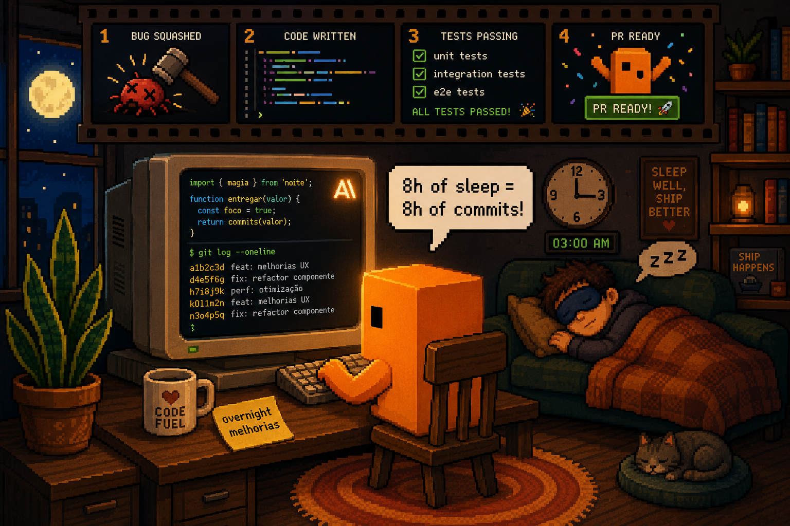
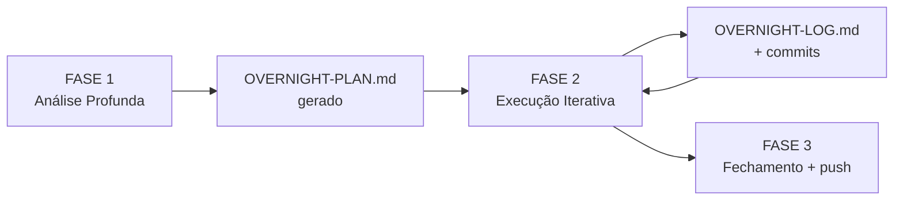

<div align="center">



# 🌙 Claude Loop

### Faça o Claude Code trabalhar no seu projeto enquanto você dorme.

**8 horas de sono = 8 horas de código, commits, testes e melhorias.**
**Você acorda com o software melhor do que deixou.**

[](https://learn.microsoft.com/en-us/powershell/)
[](https://claude.com/claude-code)
[](LICENSE)
[](https://github.com/keysjoao/claude-loop/pulls)

</div>

---

## ✨ O que é isso?

Um conjunto de scripts + um prompt mestre (`loop.md`) que transforma o **Claude Code** num **engenheiro noturno autônomo**. Você diz o que quer ao deitar, ele:

- 🧠 **Lê** seu `CLAUDE.md` e `TODO.md` pra entender o projeto
- 📝 **Gera** um plano (`OVERNIGHT-PLAN.md`) priorizando UX, bugs e refactors
- 🛠️ **Executa** as tarefas iteração por iteração — código real, não mockup
- ✅ **Commita** em português, com mensagens descritivas
- 📋 **Documenta** tudo em `OVERNIGHT-LOG.md` pra você revisar de manhã
- 🔁 **Roda em loop** automaticamente (30min, 1h, 8h — você escolhe)

> **Resultado real:** num único projeto, uma noite gerou **60+ commits** — fixes de UX, a11y, performance, refactors, novos componentes. Tudo seguindo as **Laws of UX** + princípios SOLID/DRY.

---

## 🎯 Pra quem é

| Você é... | Como o Claude Overnight te ajuda |
|---|---|
| 👨‍💻 **Dev solo** | Multiplica seu tempo. Acorda com PR pronto pra revisar. |
| 🚀 **Founder técnico** | Roda em paralelo enquanto você foca em produto/clientes. |
| 🎨 **Indie hacker** | Polimento de UX automático seguindo 12 Laws of UX. |
| 📚 **Leigo curioso** | Plug & play — `setup.ps1` e pronto. Não precisa saber nada de IA. |

---

## ⚡ Quickstart (3 minutos)

### 1. Pré-requisitos

- [Claude Code](https://claude.com/claude-code) instalado e logado
- Windows com PowerShell *(Mac/Linux: PRs bem-vindos!)*
- Um projeto com Git inicializado

### 2. Clone e instale

```powershell
git clone https://github.com/keysjoao/claude-loop.git
cd claude-loop
.\setup.ps1
```

O `setup.ps1` faz tudo automaticamente:
- ✅ Habilita **Agent Teams** (multi-agentes em paralelo)
- ✅ Instala o `loop.md` global em `~/.claude/`
- ✅ Desabilita suspensão do Windows na tomada
- ✅ Mantém o monitor desligando em 2h pra economizar energia

### 3. Use de dentro do Claude Code (recomendado)

```powershell
cd C:\meu-projeto
claude
```

Dentro do Claude:

```
/loop 30m
```

Pronto. A cada 30min ele executa o `loop.md` e continua o trabalho.
Vai dormir. 💤

---

## 🧰 O que vem na caixa

| Arquivo | Função |
|---|---|
| **`setup.ps1`** | Instala tudo. Roda uma vez só. |
| **`loop.md`** | O prompt mestre — instruções do que fazer a cada iteração. |
| **`overnight.ps1`** | Modo headless: roda o Claude em loop sem precisar abrir o app. |
| **`start-overnight.ps1`** | Atalho com defaults sensatos pra começar rápido. |
| **`update-loop.ps1`** | Sincroniza o `loop.md` deste repo com o `~/.claude/` global. |
| **`fix.ps1`** | Conserta problemas comuns de setup. |
| **`PROMPTS-PRONTOS.md`** | Prompts pra colar direto no Claude Code. |

---

## 🛠️ 3 modos de uso

### 🅰️ `/loop 30m` dentro do Claude Code *(recomendado)*

```powershell
cd C:\seu-projeto
claude
```
```
/loop 30m
```

A cada 30min o Claude relê `loop.md` e segue o plano. Modo mais limpo e auditável.

### 🅱️ Headless via PowerShell

```powershell
.\overnight.ps1 -ProjectPath "C:\seu-projeto" -Iterations 20 -PauseMinutes 5
```

Roda 20 iterações sem precisar abrir o app. Ideal pra quem vai fechar o laptop *(deixe na tomada)*.

### 🅲 Prompt manual

Abra o Claude Code no projeto e cole um prompt do [`PROMPTS-PRONTOS.md`](PROMPTS-PRONTOS.md). Sem loop, mas sem barreira de entrada.

---

## 🧠 Como funciona o `loop.md`

O prompt mestre instrui o Claude a operar em **3 fases**:



- **FASE 1** — Lê `CLAUDE.md`, mapeia componentes, roda `/code-review`, analisa cada tela contra **12 Laws of UX**, gera o plano.
- **FASE 2** — Executa item por item, prioriza bugs > UX > refactor > polish > a11y > perf > testes > docs. Commita após cada melhoria.
- **FASE 3** — Push final, `/code-review` no conjunto, gera "Resumo da Noite".

### Princípios que ele sempre aplica

🎨 **Laws of UX** — Hick, Fitts, Jakob, Doherty, Peak-End, Zeigarnik, Miller, Tesler...
🏗️ **SOLID + DRY + KISS** — Reutiliza componentes existentes, nunca recria.
🔌 **Plugins** — Usa `/superpowers`, `/code-review`, `/code-simplifier`, `/feature-dev`, `/frontend-design`, `/playwright`, `/supabase` quando faz sentido.

---

## 🛡️ Regras invioláveis (built-in)

O `loop.md` proíbe o Claude de:

- ❌ Deletar `.env`, configs, secrets
- ❌ Force push ou alterar histórico do git
- ❌ Mudar framework, roteamento ou banco
- ❌ Adicionar dependências pesadas sem justificativa
- ❌ Recriar componentes que já existem

E obriga a:

- ✅ Trabalhar numa branch `overnight/melhorias-AAAA-MM-DD`
- ✅ Commits pequenos, em português, com escopo claro
- ✅ Pular tarefa se travar 15min — documentar e seguir

---

## 💡 Dicas pra resultados melhores

1. **Capriche no `CLAUDE.md`** — quanto mais contexto (stack, convenções, decisões), melhor.
2. **Marque `[TONIGHT]`** nas tarefas do `TODO.md` que quer priorizar.
3. **Comece pequeno** — uma noite de 4h antes de soltar 8h direto.
4. **Branch dedicada** — deixa o Claude na `overnight/...` pra você revisar PR de manhã.
5. **Deixe na tomada** — o `setup.ps1` desabilita suspensão, mas bateria acaba.
6. **Não feche o terminal** — se rodar headless, deixe a janela aberta.

---

## 🌅 De manhã

```powershell
cd C:\seu-projeto
git log --oneline -30      # ver tudo que rolou
cat OVERNIGHT-LOG.md       # resumo iteração por iteração
git diff master...HEAD     # revisar mudanças
```

Aprova o que gostou, descarta o resto. É só git.

---

## ❓ FAQ

**Custa caro?**
Depende do seu plano Claude. Loop de 30min em 8h ≈ 16 iterações. Cada iteração varia (pode ler/editar dezenas de arquivos). Use o plano Max se for rodar todo dia.

**Funciona em Mac/Linux?**
Os scripts são PowerShell (Windows). O `loop.md` e a ideia funcionam em qualquer sistema — basta adaptar para `bash`. **PRs bem-vindos.**

**Posso usar em projeto da empresa?**
Sim, mas leia as regras invioláveis e teste em branch isolada primeiro. Não é mágico — revise os PRs.

**E se o Claude fizer besteira?**
Trabalha em branch separada e faz commits incrementais. Pior caso: `git reset --hard` e perdeu uma noite. Por isso branch dedicada é regra.

**Preciso saber programar pra usar?**
Pra rodar, não. Pra revisar de manhã, sim. É IA, não milagre.

---

## 🤝 Contribuindo

PRs, issues e ideias são MUITO bem-vindas. Especialmente:

- 🐧 Versão `bash`/`zsh` pra Mac/Linux
- 📝 Variações do `loop.md` por stack (Next.js, Rails, Django...)
- 🎯 Mais prompts em `PROMPTS-PRONTOS.md`
- 📊 Sistema de métricas pós-overnight

---

## 📜 Licença

[MIT](LICENSE) — use, copie, modifique, venda. Só não me processe se o Claude refatorar o seu monolito inteiro às 3 da manhã. 😅

---

<div align="center">

**Feito com ☕ e noites de sono recuperadas por [@keysjoao](https://github.com/keysjoao)**

Se isso te ajudou, deixa uma ⭐ — ajuda outros devs a descobrirem.

</div>
